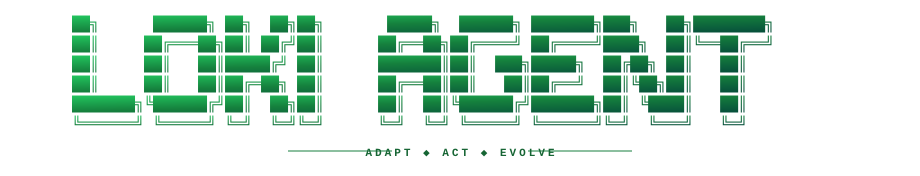

<div align="center">

<picture>
  <source media="(prefers-color-scheme: dark)" srcset="assets/loki-wordmark-dark.svg">
  <source media="(prefers-color-scheme: light)" srcset="assets/loki-wordmark-light.svg">
  
</picture>

### The adaptive personal agent

Loki learns how you work, acts across your tools, and stays under your control.

[Getting started](#getting-started) · [Architecture](#architecture) · [Roadmap](#roadmap) · [Contributing](CONTRIBUTING.md)

</div>

> [!IMPORTANT]
> Loki is in its foundation phase. It is usable by developers, but its identity,
> packaging, installers, and inherited surfaces are still being separated from
> the Hermes Agent compatibility layer.

## What is Loki?

Loki is an open, local-first agent for people who want an AI that can do real
work instead of living in a chat box. It can reason with the model provider you
choose, operate a terminal and browser, remember useful context, build reusable
skills, delegate work to subagents, run scheduled jobs, and meet you through a
CLI, terminal UI, desktop app, or messaging gateway.

The goal is an agent that becomes more useful as it learns your environment
without turning your identity, credentials, or workflows into somebody else's
platform. Bring your own models and keys. Keep the runtime where you choose.
Extend it through skills and plugins instead of waiting for a central vendor.

Loki starts from the excellent open-source work in
[Nous Research's Hermes Agent](https://github.com/NousResearch/hermes-agent).
We preserve its Git history and MIT attribution, maintain a read-only upstream
remote, and can deliberately incorporate future upstream improvements. Loki is
a standalone project, not a GitHub fork and not an official Nous Research
product.

## What Loki can do

- **Act:** use a real terminal, files, web research, browser automation, and
  connected services.
- **Learn:** retain useful memories and turn repeated work into skills.
- **Delegate:** split larger outcomes across specialized subagents.
- **Run anywhere:** work through a classic CLI, rich TUI, desktop surface,
  messaging gateways, scheduled jobs, and remote hosts.
- **Use your models:** connect supported providers with your own credentials
  instead of depending on one bundled model subscription.
- **Grow at the edges:** add skills and plugins while keeping the agent core
  narrow and understandable.

## Architecture

```text
                       ┌─────────────────────────┐
                       │       Loki core         │
                       │ reason · act · remember │
                       └────────────┬────────────┘
                                    │
          ┌─────────────────────────┼─────────────────────────┐
          │                         │                         │
    ┌─────▼─────┐            ┌──────▼──────┐           ┌─────▼─────┐
    │ Surfaces  │            │ Capabilities│           │ Providers │
    │ CLI / TUI │            │ skills      │           │ models    │
    │ desktop   │            │ plugins     │           │ memory    │
    │ gateways  │            │ tools       │           │ sandboxes │
    └───────────┘            └─────────────┘           └───────────┘
```

The same agent core powers every surface. Skills carry learned procedures;
plugins connect substantial or third-party capabilities; providers keep models,
memory, and execution backends replaceable.

## Getting started

### Requirements

- Git with Git LFS
- Python 3.11–3.13
- [uv](https://docs.astral.sh/uv/)
- Node.js 22+ only when working on JavaScript surfaces

### Install from source

```bash
git clone https://github.com/october-dev/loki.git
cd loki

uv venv ~/.hermes/venvs/loki --python 3.11
source ~/.hermes/venvs/loki/bin/activate
uv pip install -e ".[all]"

loki setup
loki
```

For development, install `.[all,dev]` and read
[CONTRIBUTING.md](CONTRIBUTING.md).

## Compatibility boundary

The public command is `loki`. During the upstream-compatible transition, these
inherited identifiers intentionally remain stable:

- the Python distribution and module namespace: `hermes-agent` / `hermes_cli`
- the data directory: `~/.hermes`
- environment variables: `HERMES_*`
- the legacy commands: `hermes`, `hermes-agent`, and `hermes-acp`

This is not unfinished search-and-replace work. Keeping those seams stable
protects existing installs and makes upstream merges reviewable. New public
interfaces use the Loki name; compatibility identifiers will only move behind
explicit migrations.

## Updating Loki

`loki update` follows the standalone Loki repository. It does not merge Hermes
Agent automatically. Upstream changes are reviewed and integrated by maintainers
so they cannot silently overwrite Loki-specific behavior or branding.

Maintainers can follow the repeatable process in [UPSTREAM.md](UPSTREAM.md).

## Security

Loki can execute commands and access resources available to its process. An
approval prompt is a guardrail, not a security boundary. Use OS-level isolation
for untrusted inputs or production deployments, scope credentials tightly, and
review third-party skills and plugins before installing them. Read the full
[security policy](SECURITY.md) before exposing a gateway or agent endpoint.

## Roadmap

- Complete Loki-native packaging and installers without breaking compatibility.
- Establish a stable agent, skill, plugin, and provider SDK.
- Make model, memory, execution, and interface layers independently replaceable.
- Improve local and remote operation across desktop, server, and messaging
  surfaces.
- Build safe, inspectable learning loops for memories, skills, and automation.
- Publish a transparent upstream intake and release process.

Roadmap work is tracked in [GitHub Issues](https://github.com/october-dev/loki/issues).

## Contributing

Loki is intended to be infrastructure people can inspect, extend, and build on.
Bug fixes, portability work, provider adapters, focused plugin surfaces,
documentation, tests, and security improvements are welcome. Please read the
[contribution guide](CONTRIBUTING.md) and search existing issues before starting
larger work.

When a fix also benefits Hermes Agent, we will look for a clean way to
contribute it upstream.

## Origin and license

Loki is derived from
[Hermes Agent](https://github.com/NousResearch/hermes-agent), originally created
by Nous Research and its contributors. The original commit history is retained,
and detailed provenance is recorded in [ATTRIBUTION.md](ATTRIBUTION.md).

The project is licensed under the [MIT License](LICENSE). The original Nous
Research copyright notice remains intact; Loki modifications are maintained by
October and contributors.
